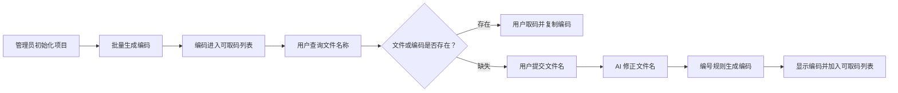

# 企业微信文件编号系统方案（精简版）

> 流程依据：`文件编号系统流程.pdf`  
> 编号依据：`编号规则采集模板.yaml`、`文件简号.xlsx`

## 1. 建设目标

将文件编号系统嵌入企业微信，提供管理员界面和用户界面，实现以下主流程：

`管理员初始化项目并批量生成编码 → 用户取码 → 用户发现文件或编码缺失 → 用户提交文件名 → AI 修正文件名并发码`

系统只围绕上述流程建设，不增加复杂审批、统计或扩展管理功能。

## 2. 企业微信入口与角色

系统采用企业微信自建应用页面作为统一入口，并沿用企业微信成员身份。

| 角色 | 进入界面 | 主要操作 |
|---|---|---|
| 用户 | 用户界面 | 查询文件编码、取码、提交缺失文件名、接收 AI 生成的编码 |
| 管理员 | 管理员界面 | 创建项目、上传文件名称清单、批量生成编码、查看生成结果 |

## 3. 主流程

### 3.1 管理员初始化项目并批量生成编码

1. 管理员填写项目名称和项目号。
2. 管理员上传只含“文件名称”的清单，文件名称不带项目号。
3. AI 对文件名称进行必要的标准化。
4. 编号规则模块根据 A～H 规则批量生成编码。
5. 管理员查看待确认的编码预览和失败原因；失败项可手动修正后重试。
6. 成功预览在管理员确认前不写入正式编码库。
7. 管理员确认后，成功文件名称和编码一次性写入正式编码库并进入可取码列表。
8. 管理员可从项目列表重新打开待确认或已启用项目。
9. 管理员可在项目内通过 AI 新增文件；AI 无法匹配时可输入完整编码手工补码，也可删除文件、编码或整个项目。

### 3.2 用户取码

1. 用户进入企业微信中的文件编号应用。
2. 用户选择项目并输入文件名称。
3. 系统查询文件名称及对应编码。
4. 查询成功时，用户点击“取码”，查看并复制编码。

### 3.3 用户发现文件或编码缺失

查询无结果时，用户界面显示“新增文件编码”入口，无需切换到其他系统。

### 3.4 AI 修正文件名并发码

1. 用户输入或上传文件名称。
2. AI 根据现有文件名称及 `文件简号.xlsx` 修正文件名称。
3. 系统使用修正后的名称再次查询；已有编码时直接返回。
4. 没有编码时，编号规则模块生成新编码。
5. 系统向用户显示“修正后文件名称 + 编码”，并将其加入可取码列表。

AI 只负责文件名称修正和编号字段识别，最终编码由固定规则生成。

## 4. 界面设计

### 4.1 用户界面：编码领取

页面只保留以下内容：

- 项目选择。
- 文件名称搜索框。
- “查询/取码”按钮。
- 查询结果：文件名称、编码、复制按钮。
- 查询无结果时显示“新增文件编码”。
- 缺失文件名称输入或上传。
- AI 处理结果：原文件名、修正后文件名、生成编码。

### 4.2 管理员界面：项目初始化

页面只保留以下内容：

- 项目名称和项目号。
- 文件名称清单上传。
- “批量生成编码”按钮。
- 生成结果：原文件名、修正后文件名、编码预览、结果状态和删除操作。
- 项目内 AI 新增文件；AI 无法匹配时手工补码。
- “确认成功项并写入编码库”按钮。
- “删除项目”按钮。

## 5. 编号规则

用户不输入部组件级别。编号字段由系统按文件名称取得或判断。

| 部分 | 内容 | 规则 |
|---|---|---|
| A | 固定值 | `GH` |
| B | 项目号 | 取当前项目单独填写或选择的 4 位项目号 |
| C | 部组件级别 | PCBA、未明确类型的板卡、软件、逻辑、操作系统=`5`；PCB=`7`；两个及以上设备组成的系统=`2`；单台设备=`3` |
| D | 功能 | 两位大写字母 |
| E | 固定值 | `010` |
| F | 文件简号 | 根据 `文件简号.xlsx` 判定；匹配项位于“以下为软件：”标记行之后时，完整文件号增加 `R-` 前缀 |
| G | 阶段号 | 正样件=`Z`；鉴定件=`C`；其他为空 |
| H | 版本号 | 正样件=`2.00`；其他=`1.00` |

必须先判断 PCBA，再判断明确的 PCB；仅写“板卡”时按 PCBA 处理为 5 级。软件、逻辑及操作系统类均为 5 级。

名称规范化：`逻辑单元集成测试`替换为`仿真测试`；`逻辑配置项测试`替换为`确认测试`。

`R-` 仅以 `文件简号.xlsx` 中“以下为软件：”标记行之后的匹配结果为准。

文件类型为“评审结论报告”时，完整编码最前增加 `P-`；若同时为软件类，前缀顺序为 `P-R-`。

G 有值时：

`AB-CD-EF-G-H`

G 为空时：

`AB-CD-EF-H`

示例：

- `GH1234-3KZ-010JY-Z-2.00`
- `GH1234-3KZ-010JY-1.00`
- `R-GH1234-5KZ-010SCP-1.00`（软件类）

## 6. 验收要求

1. 管理员能够初始化项目并批量生成编码。
2. 用户能够在企业微信中查询、取用和复制编码。
3. 查询缺失时，用户能够直接提交文件名称。
4. AI 能够返回修正后的文件名称，系统能够按规则生成并显示编码。
5. 批量生成和单次生成使用同一套 A～H 编号规则。
6. 文件类型为评审结论报告时，完整编码以 `P-` 开头；同时为软件类时以 `P-R-` 开头。
