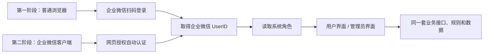

# 文件编号系统开发计划（两阶段精简版）

> 业务依据：`文件编号系统流程.pdf`、`文件编号系统企业微信应用实现方案.md`  
> 技术依据：`文件编号系统系统设计方案.md`  
> 规则依据：`编号规则采集模板.yaml`、`文件简号.xlsx`

## 1. 开发目标与边界

系统按两个阶段交付：

| 阶段 | 使用入口 | 认证方式 | 阶段结果 |
|---|---|---|---|
| 第一阶段 | 独立 Web 地址 | 用户使用企业微信扫码登录 | 形成可独立使用的完整 Web 系统 |
| 第二阶段 | 企业微信自建应用 | 打开应用后自动网页授权 | 在企业微信客户端内免登录使用 |

两个阶段共用同一套前端、Python 后端、数据库、用户角色、AI 接口和编号规则。第二阶段只增加企业微信客户端入口及自动认证，不重新开发业务功能。

开发范围只包括：

1. 管理员初始化项目并批量生成编码。
2. 用户查询、取码和复制编码。
3. 文件或编码缺失时，用户提交文件名。
4. AI 修正文件名，规则模块生成编码。

不增加审批、统计、通知及其他扩展功能。

## 2. 总体实施路线

建议总工期为 5 周：

| 阶段 | 建议工期 | 前置条件 |
|---|---:|---|
| 第一阶段 | 4 周 | HTTPS 域名、企业微信应用参数、模型接口可用 |
| 第二阶段 | 1 周 | 第一阶段验收通过，企业微信应用入口可配置 |

工期按前端、后端可并行开发估算，不包含企业内部账号申请、网络审批和服务器采购时间。

## 3. 第一阶段：Web 系统与企业微信扫码登录

### 3.1 阶段目标

用户在普通浏览器打开系统 Web 地址，使用企业微信扫描登录二维码。认证成功后，系统根据成员身份进入用户界面或管理员界面，并可完成全部既定业务。

“脱离企业微信客户端”只表示系统运行在普通浏览器中；扫码登录仍需使用企业微信的 CorpID、AgentID、CorpSecret 和授权回调域。

### 3.2 开发任务

| 周次 | 工作内容 | 主要交付结果 |
|---|---|---|
| 第 1 周 | 建立 Vue、FastAPI、PostgreSQL 和 Docker Compose 工程；配置 HTTPS；开发 Web 登录页；接入企业微信扫码授权、回调、UserID 获取、角色映射和安全会话 | 可扫码登录的系统骨架 |
| 第 2 周 | 建立最小数据表和数据库迁移；读取 `文件简号.xlsx` 与 YAML 规则；实现 A～H 编号模块、查重和规则测试；实现项目初始化、批量生成、查询和取码接口 | 可独立测试的 Python 业务接口 |
| 第 3 周 | 完成管理员页面和用户页面；接入 AI 文件名修正及结构化结果校验；打通批量生成、查询取码和缺失发码流程 | 完整 Web 业务流程 |
| 第 4 周 | 完成企业微信真实账号联调、规则回归、异常处理、安全检查和部署；修复问题并形成验收版本 | 第一阶段可上线版本 |

### 3.3 扫码认证任务

1. 普通浏览器未登录时显示企业微信登录二维码。
2. 后端生成扫码授权地址和一次性 `state`。
3. 用户扫码确认后，企业微信将 `code` 和 `state` 回调至系统。
4. 后端校验 `state`，使用一次性 `code` 获取企业微信 UserID。
5. 系统按 UserID 查询本地用户角色并建立安全会话。
6. 用户进入对应的用户界面或管理员界面。
7. 处理二维码过期、取消授权、非企业成员及不在应用可见范围等情况。

建议认证接口：

| 方法 | 接口 | 作用 |
|---|---|---|
| `GET` | `/api/auth/wecom/qr/start` | 生成扫码登录地址 |
| `GET` | `/api/auth/wecom/qr/callback` | 接收扫码授权回调 |
| `GET` | `/api/me` | 获取当前成员和角色 |
| `POST` | `/api/auth/logout` | 退出当前会话 |

### 3.4 第一阶段交付物

1. 独立 Web 访问地址。
2. 企业微信扫码登录页。
3. 用户界面和管理员界面。
4. Vue 前端、Python 后端和数据库程序。
5. Docker Compose 部署配置。
6. 编号规则自动化测试及阶段验收记录。

### 3.5 第一阶段验收

1. 用户可在普通浏览器打开系统并使用企业微信扫码登录。
2. 系统能够取得真实企业成员 UserID，并进入正确角色界面。
3. 未授权成员不能进入系统。
4. 管理员可上传文件名称清单并批量生成编码。
5. 用户可查询、取码和复制编码。
6. 查询无结果时，用户可提交文件名并取得 AI 修正后的名称和编码。
7. 批量及单次编号均符合现有 A～H 规则。
8. CorpSecret、模型密钥和数据库密码不出现在前端。

第一阶段验收通过后，进入第二阶段。

## 4. 第二阶段：嵌入企业微信与自动认证

### 4.1 阶段目标

将第一阶段的 H5 页面配置为企业微信自建应用入口。成员从企业微信工作台打开应用时，系统自动完成身份认证，不显示二维码，也不要求输入账号密码。

### 4.2 开发任务

| 工作项 | 开发内容 |
|---|---|
| 企业微信配置 | 配置自建应用主页、可信域名、网页授权回调地址和应用可见范围 |
| 入口识别 | 未登录时识别是否位于企业微信客户端；该识别只决定认证入口，不作为身份依据 |
| 自动认证 | 企业微信客户端内自动进入 `snsapi_base` 网页授权，取得 `code` 后由后端换取 UserID |
| 统一会话 | 自动认证成功后复用第一阶段的用户映射、角色判断和安全会话 |
| 页面适配 | 检查企业微信桌面端和移动端的页面尺寸、上传、复制及返回行为 |
| 回归测试 | 重新验证管理员批量生成、用户取码和缺失发码，不修改业务逻辑 |

建议新增认证接口：

| 方法 | 接口 | 作用 |
|---|---|---|
| `GET` | `/api/auth/wecom/oauth/start` | 发起企业微信客户端内网页授权 |
| `GET` | `/api/auth/wecom/oauth/callback` | 接收网页授权回调 |

自动认证流程：

1. 成员从企业微信工作台打开应用。
2. 前端调用 `/api/me` 检查当前会话。
3. 无有效会话时，自动跳转企业微信网页授权。
4. 企业微信携带 `code` 和 `state` 返回系统。
5. 后端校验回调并取得 UserID。
6. 系统建立与第一阶段相同的会话并进入对应角色页面。
7. 已有有效会话时直接打开业务页面，不重复发起授权。

### 4.3 第二阶段交付物

1. 企业微信自建应用入口。
2. 客户端内自动认证接口及配置。
3. 企业微信桌面端和移动端适配结果。
4. 两种认证入口的回归测试记录。
5. 第二阶段可上线版本。

### 4.4 第二阶段验收

1. 成员从企业微信打开应用时无需扫码或输入密码。
2. 系统能够自动取得当前成员身份并进入正确角色界面。
3. 已登录成员再次进入应用时不重复跳转授权。
4. 授权失败时显示可重试提示，不出现循环跳转。
5. 企业微信端与 Web 端使用相同用户、项目、编码和取码数据。
6. 企业微信桌面端和移动端均可完成既定业务。
7. 第一阶段 Web 扫码登录仍可正常使用。

## 5. 两阶段共用的认证与安全要求

1. 两种入口均以企业微信返回的 UserID 作为身份依据。
2. 用户或管理员角色从数据库读取，不接受前端传入角色。
3. `state` 随机生成、短时有效、一次使用，并与认证入口绑定。
4. 回调地址使用白名单，防止跳转到非系统地址。
5. 系统会话使用 `HttpOnly`、`Secure` 和适当的 `SameSite` Cookie。
6. CorpSecret 和企业微信 access_token 仅由 FastAPI 后端管理。
7. access_token 在后端缓存并按有效期刷新，避免每次请求重复获取。
8. 日志只记录认证结果和错误码，不记录 Secret、完整令牌或授权码。

## 6. 开发前需准备的资料

| 资料 | 用途 |
|---|---|
| 企业微信 CorpID | 两阶段身份认证 |
| 自建应用 AgentID、CorpSecret | 获取 access_token 和成员身份 |
| Web 授权回调域 | 第一阶段扫码登录 |
| H5 可信域名及应用主页地址 | 第二阶段客户端内自动认证 |
| 应用可见范围 | 控制允许使用系统的企业成员 |
| 用户、管理员测试账号 | 角色和权限验收 |
| HTTPS 域名、证书和部署服务器 | 系统部署及企业微信回调 |
| 企业批准的大模型地址及密钥 | AI 文件名修正 |

企业微信认证参考：

- [扫码授权登录](https://developer.work.weixin.qq.com/document/path/91025)
- [构造网页授权链接](https://developer.work.weixin.qq.com/document/path/91022)
- [获取访问用户身份](https://developer.work.weixin.qq.com/document/path/91023)

## 7. 完成标准

第二阶段验收通过后，系统达到最终状态：

`Web 浏览器扫码登录 + 企业微信客户端自动认证 + 同一套文件编号业务`

除认证入口不同外，两端的页面、角色、接口、AI 处理、编号结果和数据库完全一致。
