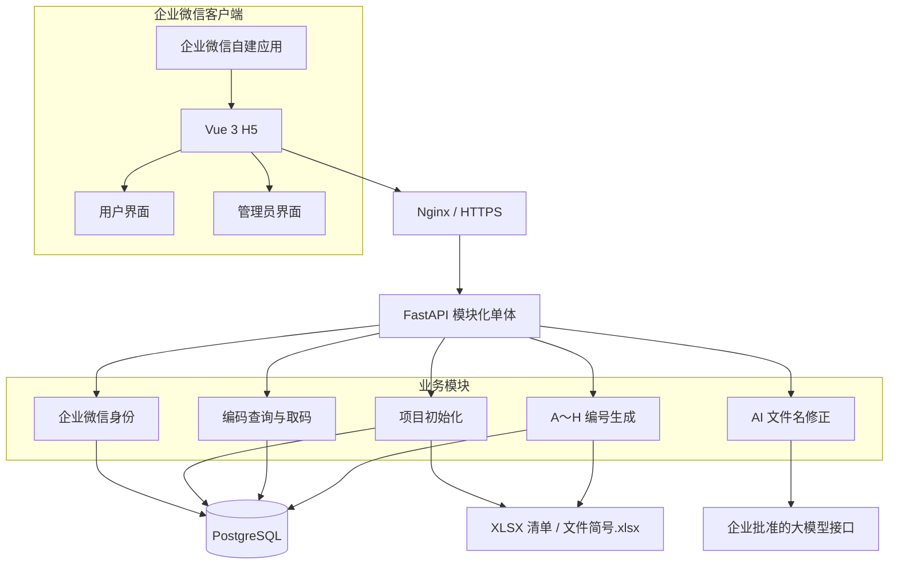
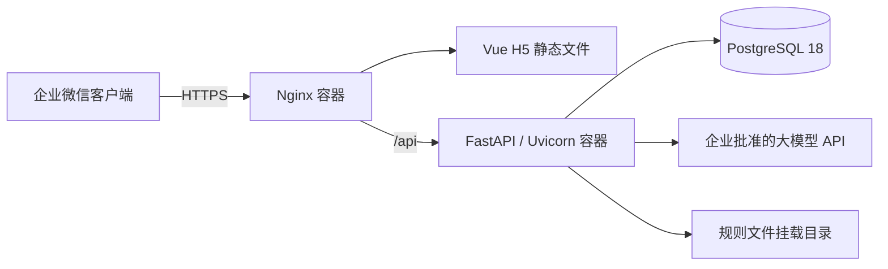

# 文件编号系统系统设计方案（精简版）

## 1. 设计范围

系统嵌入企业微信，仅设计以下能力：

1. 管理员初始化项目并批量生成编码。
2. 用户查询和取码。
3. 用户提交缺失文件名。
4. AI 修正文件名，编号规则模块生成并返回编码。

系统规模较小，首期采用模块化单体架构，不拆分微服务。

## 2. 技术选型

| 层次 | 技术选型 | 选择理由 |
|---|---|---|
| 企业微信端 | 企业微信自建应用 + H5 | 直接嵌入企业微信，复用成员身份 |
| 前端框架 | Vue 3 + TypeScript + Vite | 适合轻量单页应用，类型清晰、构建简单 |
| 移动端组件 | Vant 4 | 面向移动 Web，适合企业微信内页面 |
| 后端语言 | Python 3.13 | 官方支持版本，依赖兼容成熟 |
| 后端框架 | FastAPI + Uvicorn | 适合轻量 REST 接口和模块化单体部署 |
| 数据校验与 AI 接入 | Pydantic 2 + HTTPX | 调用企业批准的大模型接口，并校验结构化输出 |
| 数据访问 | SQLAlchemy 2 + Alembic + Psycopg 3 | 访问 PostgreSQL，并管理数据库结构变更 |
| 数据库 | PostgreSQL 18，采用当前最新小版本 | 保存项目、文件编码和取码记录，并提供事务及唯一约束 |
| 文件解析 | openpyxl | 读取 XLSX 清单和 `文件简号.xlsx` |
| Web 入口 | Nginx | 提供 HTTPS、前端静态文件和后端接口反向代理 |
| 部署 | Docker + Docker Compose | 用一份配置启动前端、后端和数据库，适合首期规模 |
| 接口形式 | REST + JSON | 页面和后端交互简单直接 |

选型依据：

- [Vue 3 与 TypeScript](https://vuejs.org/guide/typescript/overview)
- [Vant 4](https://vant-ui.github.io/)
- [Python 版本支持状态](https://devguide.python.org/versions/)
- [FastAPI](https://fastapi.tiangolo.com/)
- [Pydantic 数据校验](https://docs.pydantic.dev/latest/)
- [SQLAlchemy 2.0](https://docs.sqlalchemy.org/en/20/)
- [Alembic](https://alembic.sqlalchemy.org/en/latest/)
- [Psycopg 3](https://www.psycopg.org/psycopg3/docs/)
- [PostgreSQL 当前文档](https://www.postgresql.org/docs/current/)
- [openpyxl](https://openpyxl.readthedocs.io/en/stable/)
- [Docker Compose](https://docs.docker.com/compose/)

## 3. 系统架构

### 3.1 逻辑架构

### 3.2 架构说明

| 层次 | 组成 | 职责 |
|---|---|---|
| 客户端层 | 企业微信、Vue H5 | 展示用户界面或管理员界面 |
| 接入层 | Nginx | HTTPS 接入、静态页面、API 代理 |
| 应用层 | FastAPI + Uvicorn | 承载全部业务模块和 REST 接口 |
| AI 与规则层 | Pydantic、HTTPX、Python 编号规则、openpyxl | 修正文件名、校验模型输出、读取规则、生成编码 |
| 数据层 | PostgreSQL | 保存用户、项目、编码和取码记录 |

前端、后端各保留一套工程。AI 调用位于后端内部，不单独建设 AI 微服务。

### 3.3 核心调用链

批量生成：

`管理员 H5 → FastAPI → openpyxl 读取清单 → AI 修名 → 编号规则生成 → PostgreSQL`

用户取码：

`用户 H5 → FastAPI 查询 → PostgreSQL → 返回编码`

缺失发码：

`用户 H5 → FastAPI → AI 修名 → 查重 → 编号规则生成 → PostgreSQL → 返回编码`

## 4. 企业微信接入

1. 在企业微信管理后台创建自建应用。
2. 将系统 H5 地址配置为应用入口。
3. H5 使用企业微信网页授权取得授权 `code`。
4. 后端通过 `code` 获取企业微信成员 UserID。
5. 后端根据 UserID 返回用户界面或管理员界面。
6. 用户不需要再次注册或输入独立账号密码。

企业微信的 CorpSecret、模型密钥和数据库密码只保存在后端配置中，不下发到 H5。

企业微信接入参考：

- [构造网页授权链接](https://developer.work.weixin.qq.com/document/path/91022)
- [获取访问用户身份](https://developer.work.weixin.qq.com/document/path/91023)

## 5. 页面设计

### 5.1 用户界面

用户界面为一个页面，包含两个区域。

#### 编码领取区

| 控件 | 说明 |
|---|---|
| 项目选择 | 选择当前项目 |
| 文件名称 | 输入需要查询的文件名称 |
| 查询/取码 | 查询编码并确认取用 |
| 结果区 | 显示文件名称、编码和复制按钮 |

#### 缺失文件发码区

仅在查询无结果时显示：

| 控件 | 说明 |
|---|---|
| 文件名称输入/上传 | 提交缺失的文件名称 |
| AI 修正并发码 | 启动名称修正和编号生成 |
| 结果区 | 显示原文件名、修正后文件名和编码 |

### 5.2 管理员界面

管理员界面为“项目初始化”页面：

| 控件 | 说明 |
|---|---|
| 项目名称 | 新项目名称 |
| 项目号 | 单独填写 4 位项目号；清单中的文件名称不带项目号 |
| 清单上传 | 上传只含“文件名称”的 XLSX 或 CSV |
| 批量生成编码 | 执行名称修正和编号生成 |
| 结果区 | 显示原文件名、修正后文件名、编码预览和失败原因；失败项可手动修正并重试 |
| 确认启用 | 将成功预览一次性写入正式编码库并加入可取码列表 |
| 项目列表 | 可重新打开待确认或已启用项目并查看编码明细 |
| 项目内新增 | 优先复用用户侧 AI 修名和发码逻辑；AI 无法匹配时，管理员可输入完整编码手工补码 |
| 删除 | 可删除单个文件及编码，或删除项目及其全部文件、编码和领取记录 |

复核和确认均在同一页面完成，不另设审批页面。

## 6. 核心处理流程

### 6.1 批量生成

1. 接收项目基本信息和文件名称清单。
2. openpyxl 读取 XLSX；CSV 使用 Python 标准库解析。
3. AI 逐行修正文件名称并返回结构化字段。
4. 编号规则模块规范化测试术语，并按板卡、软件、逻辑、操作系统、PCB及设备数量判定级别。
5. openpyxl 从 `文件简号.xlsx` 加载文件简号规则，确定 F；匹配项位于“以下为软件：”标记行之后时判定为软件类。
6. 软件类的 C 固定为 `5`，完整文件号增加 `R-` 前缀。
7. 文件类型为“评审结论报告”时，完整编码最前增加 `P-`；同时为软件类时使用 `P-R-`。
8. 成功项写入待确认预览，失败项记录失败原因；此时不写入正式编码表。
9. 失败项允许管理员手动修正文件名称并重新生成。
10. 管理员确认后，在一个事务中将全部成功预览写入正式编码表并启用。

### 6.2 用户取码

1. 按项目和文件名称查询。
2. 命中时返回文件名称和编码。
3. 用户点击取码后记录用户和时间，并允许复制编码。

### 6.3 缺失文件发码

1. 接收用户提交的文件名称。
2. AI 修正名称并返回结构化字段。
3. 用修正后的名称再次查询，避免重复生成。
4. 未命中时按 A～H 规则生成编码。
5. 保存编码并直接返回用户。

## 7. 模块设计

| 模块 | 主要职责 | 主要技术 |
|---|---|---|
| 企业微信身份模块 | 获取成员 UserID，区分用户和管理员 | FastAPI、HTTPX、企业微信 API |
| 项目初始化模块 | 创建项目、读取清单、批量处理 | FastAPI、openpyxl |
| 编码查询模块 | 按项目和文件名称查询编码 | SQLAlchemy、PostgreSQL |
| AI 修名模块 | 修正文件名并返回结构化字段 | HTTPX、Pydantic |
| 编号生成模块 | 根据固定 A～H 规则生成编码 | Python 规则代码、openpyxl |
| 取码模块 | 返回编码并记录取码人和时间 | FastAPI、SQLAlchemy |

## 8. 数据设计

系统保留四类最小数据：

| 表 | 主要字段 |
|---|---|
| `users` | id、wecom_user_id、name、role |
| `projects` | id、project_code、project_name |
| `file_codes` | id、project_id、original_name、standard_name、segment_a～segment_h、final_code、source、enabled |
| `code_claims` | id、file_code_id、user_id、claimed_at |

关键约束：

- `users.wecom_user_id` 唯一。
- `projects.project_code` 唯一。
- 正式编码和待确认编号均执行全局唯一约束，不允许跨项目重复。
- 同一项目和修正后文件名称已存在时，直接返回原编码，不重复生成。

`source`记录管理员批量生成、管理员 AI 新增、管理员手工补码或用户缺失发码。

## 9. 接口设计

| 方法 | 接口 | 作用 |
|---|---|---|
| `GET` | `/api/me` | 获取当前企业微信成员和界面角色 |
| `POST` | `/api/admin/projects/init` | 创建项目并批量生成编码 |
| `POST` | `/api/admin/projects/{id}/confirm` | 确认预览并写入正式编码库 |
| `POST` | `/api/admin/projects/{id}/codes` | 在项目内 AI 新增文件及编码 |
| `POST` | `/api/admin/projects/{id}/codes/manual` | AI 无法匹配时由管理员输入完整编码手工补码 |
| `DELETE` | `/api/admin/projects/{id}/codes/{code_id}` | 删除单个文件及编码 |
| `DELETE` | `/api/admin/projects/{id}` | 删除项目及其全部关联数据 |
| `GET` | `/api/codes/search` | 按项目和文件名称查询编码 |
| `POST` | `/api/codes/{id}/claim` | 用户取码 |
| `POST` | `/api/codes/generate` | 缺失文件名 AI 修正并发码 |

所有接口使用 HTTPS 和 JSON；清单上传接口使用 `multipart/form-data`。

## 10. AI 与编号规则边界

AI 输入：

- 原始文件名称。
- 当前项目号。
- 已批准的文件名称和文件简号规则。

AI 结构化输出：

- 修正后文件名称。
- 部组件级别候选。
- 功能代码候选。
- 阶段关键词。

编号规则模块负责：

- 校验 AI 输出。
- 生成 A～H。
- 根据 `文件简号.xlsx` 确定 F。
- 匹配项位于“以下为软件：”标记行之后时，将 C 固定为 `5`，并在完整文件号前增加 `R-`。
- 按有阶段号或无阶段号的格式拼接编码。

AI 不直接自由拼接最终编码。无法取得必要字段时，系统返回失败原因，不生成猜测编码。

## 11. 部署架构

首期使用 Docker Compose 部署以下服务：

| 服务 | 部署内容 |
|---|---|
| `web` | Nginx + Vue 编译后的静态文件 |
| `app` | Python 3.13 + FastAPI + Uvicorn 应用 |
| `db` | PostgreSQL 18 数据库 |

`文件简号.xlsx` 和 `编号规则采集模板.yaml` 以只读方式挂载到后端容器。数据库使用持久化卷并执行定期备份。

首期不引入 Redis、消息队列或 Kubernetes；达到单机容量上限后再评估扩展。

## 12. 验收要点

1. 企业微信成员可直接进入对应界面。
2. 管理员可通过一份文件名称清单完成项目初始化。
3. 用户可完成查询、取码和复制。
4. 文件或编码缺失时，可在同一用户界面提交文件名称并获得编码。
5. 批量和单次编号结果符合 `编号规则采集模板.yaml`。
6. 系统按本方案的技术选型完成构建，并能通过 Docker Compose 启动。
